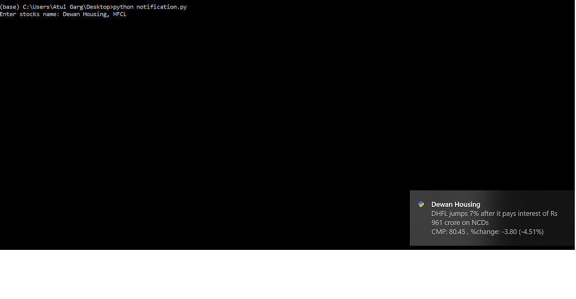

## StockPrice notifications for Windows 10
This application program will notify the user with below informations of the stocks under monitoring- 
1. Last news 
2. current price 
3. change(up/down) from previous day

--------------------
## Check Notifications

Source: MoneyControl  - "https://www.moneycontrol.com/india/stockpricequote/"

Running "python notification.py" will prompt for user input --- Provide a list of Stocks comma(',') seperated with exact names as in the Source WebPage. 

Example : 
--------------------
python notification.py

Enter stocks name: Dewan Housing, HFCL, Bank of India

Configuration provided :
---------------------
- sleep of 10 seconds between two stock's notification
- Next run of notification after sleep==1800 seconds (30 minutes)

---------------------
## Libraries uses (install if not present,using - "pip install <lib_name>")
requests (Python library to make HTTP requests to a webpage)

bs4 (Beautiful Soup: Python library for scrapping information from web pages)

win10toast (Python library for displaying Windows 10 Toast Notifications)

--------------------
Download Executable from - https://drive.google.com/drive/folders/1oZY6fukeG5pYcG4nsdOuVseH1IvS2-gM
